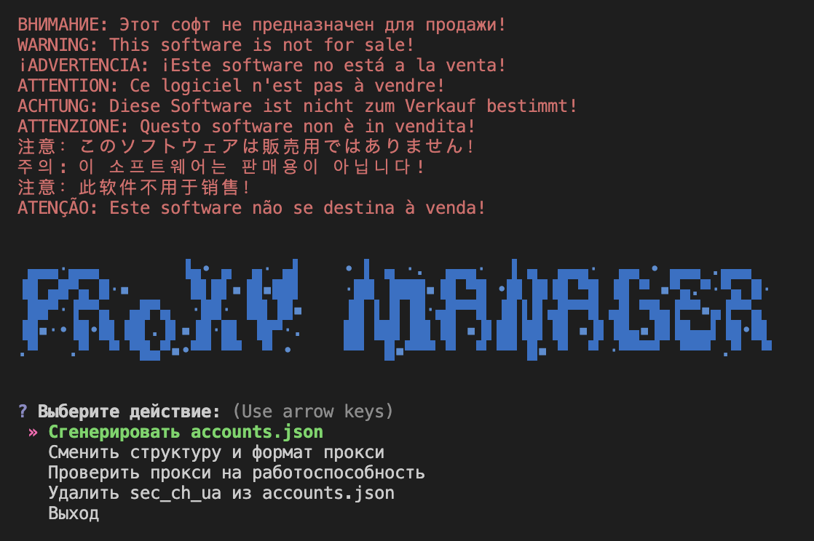

# 🚀 Account Generator & Proxy Manager

[](https://www.python.org/downloads/)
[](https://opensource.org/licenses/MIT)
[](https://github.com/yourusername/yourrepository/graphs/commit-activity)
[](http://makeapullrequest.com)
[](https://github.com/yourusername)

<div align="center">
  
  
  <h3>🛠 Мощный инструмент для генерации аккаунтов и управления прокси</h3>
</div>

<div align="center">
  
</div>

---

## 📋 Содержание

- [✨ Особенности](#-особенности)
- [📦 Установка](#-установка)
- [🚀 Использование](#-использование)
- [📁 Структура проекта](#-структура-проекта)
- [📄 Лицензия](#-лицензия)

## ✨ Особенности

- 🔄 Автоматическая генерация аккаунтов
- 🌐 Поддержка различных типов прокси (HTTP, SOCKS4, SOCKS5)
- ✅ Встроенный чекер прокси
- 🛡️ Гибкая настройка User-Agent
- 💾 Сохранение в JSON формате
- 🎨 Красивый интерактивный интерфейс

## 📦 Установка

1. **Клонируйте репозиторий:**
```bash
git clone https://github.com/yourusername/yourrepository.git
cd yourrepository
```

2. **Установите зависимости:**
```bash
pip install -r requirements.txt
```

## 🚀 Использование

1. **Запустите приложение:**
```bash
python main.py
```

2. **Выберите нужную опцию в интерактивном меню:**
   - 📝 Генерация accounts.json
   - 🔄 Управление прокси
   - ✅ Проверка прокси
   - 🗑️ Удаление sec_ch_ua

## 📁 Структура проекта

```
📦 account-generator
 ┣ 📜 main.py              # Главный файл приложения
 ┣ 📜 account_generator.py # Генератор аккаунтов
 ┣ 📜 agents.py           # Генерация User-Agent
 ┣ 📜 proxy_changer.py    # Управление прокси
 ┣ 📜 proxy_checker.py    # Проверка прокси
 ┣ 📜 utils.py            # Вспомогательные функции
 ┣ 📜 requirements.txt    # Зависимости проекта
 ┣ 📜 proxies.txt         # Список прокси
 ┗ 📂 data                # Директория с данными
```

## ⚙️ Конфигурация

### Формат прокси в proxies.txt:
```plaintext
http://username:password@ip:port
socks5://username:password@ip:port
ip:port:username:password
```

### Основные зависимости:
```plaintext
aiohttp==3.10.10
requests==2.32.3
rich==13.9.4
tqdm==4.67.0
```

## 🤝 Вклад в проект

Мы приветствуем ваш вклад в развитие проекта! Вот как вы можете помочь:

1. 🍴 Форкните репозиторий
2. 🔧 Создайте ветку для ваших изменений
3. ✨ Внесите изменения
4. 📝 Создайте Pull Request

## 📄 Лицензия

Этот проект распространяется под лицензией MIT. Подробности в файле [LICENSE](LICENSE).

---

<div align="center">
  <sub>Built with ❤️ by @yourusername</sub>
</div>


